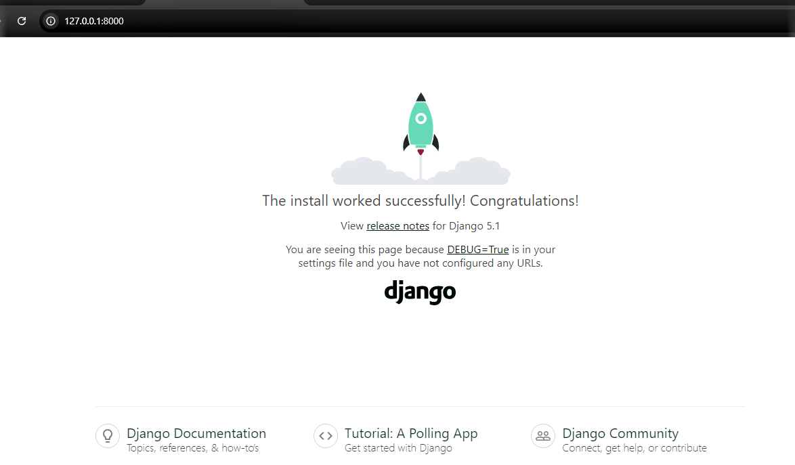

# Django guide for creating first project
## creating virtual environment 
``` 
    py -m venv myvenv    
```
## command to activate the virtual environment
```
    myvenv\Scripts\activate
```
 #### then you see the terminal as follows :
 > (myvenv) PS D:\django>

## install the django using the cmd below

```
    py -m pip install Django
```
## check the version of django

```
    django-admin --version
```
#### you get the django version in the terminal:
> 5.1.1

## create your first project using the below command

```
    django-admin startproject firstProject  
```
## go to the project folder

```
    cd firstProject
```
## create your first app

```
    py manage.py startapp firstApp
```
## now start your project by the below command

```
     py manage.py runserver
```
## click on the url shown in the terminal where your project is running on your local machine (or) open the browser and paste the url 

> http://127.0.0.1:8000/

## now you see the output as below 


